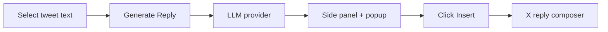

# Tweet Better

**AI reply copilot for X (Twitter).** Select any tweet text, generate thoughtful reply options with your own LLM, and insert them straight into the composer — no backend, no account, everything stays local.

<p align="center">
  <strong>Select → Generate → Pick → Insert</strong>
</p>

---

## Features

- **Selection-based workflow** — highlight the part of a tweet you want to respond to
- **Multiple entry points** — floating toolbar, right-click context menu, or FAB button
- **Side panel** — opens automatically with generated replies, tone labels, and one-click insert
- **Bring your own model** — OpenAI, Anthropic, Gemini, Groq, OpenRouter, Ollama, LM Studio, or any OpenAI-compatible endpoint
- **Tone control** — balanced, technical, funny, contrarian, supportive, and more
- **Smart insert** — finds X's reply composer, opens it if needed, and fills the text
- **Reply caching** — avoids re-generating identical requests within 15 minutes
- **Activity log** — collapsible debug trail across popup, sidebar, and background
- **Fully local settings** — API keys and preferences stored in Chrome; optional encrypted storage mode

---

## How it works



1. **Select** at least 8 characters of tweet text on [x.com](https://x.com)
2. **Generate** via the toolbar, context menu (*✨ Generate AI Reply*), or the floating **AI Reply** button
3. **Pick** a reply in the sidebar (opens automatically) or the on-page popup
4. **Insert** into the reply box — the extension opens the composer if it isn't already visible

---

## Supported providers

| Provider | API key required | Default model |
|----------|------------------|---------------|
| OpenAI | Yes | `gpt-4o-mini` |
| Anthropic | Yes | `claude-3-5-haiku-20241022` |
| Gemini | Yes | `gemini-2.0-flash` |
| Groq | Yes | `llama-3.3-70b-versatile` |
| OpenRouter | Yes | `openai/gpt-4o-mini` |
| Ollama | No (local) | `llama3.2` |
| LM Studio | No (local) | `local-model` |
| Custom | Depends | Your endpoint |

Configure provider, model, temperature, tone, and reply count in **Settings**.

---

## Installation

### From source (recommended for development)

**Requirements:** Node.js 18+, Google Chrome 116+ (side panel support)

```bash
git clone <your-repo-url>
cd tweet-better
npm install
npm run build
```

Load the extension in Chrome:

1. Open `chrome://extensions`
2. Enable **Developer mode**
3. Click **Load unpacked**
4. Select the **`dist/`** folder (not the project root)
5. Hard-refresh [x.com](https://x.com) (`Ctrl+Shift+R`)

> After code changes, run `npm run build` again and click **Reload** on the extension card. For active development, use `npm run watch` to rebuild on save.

### First-time setup

1. Click the **Tweet Better** extension icon → **Settings**
2. Choose your LLM provider and paste your API key (skip for local Ollama / LM Studio)
3. Click **Test Connection** in the popup to verify
4. Visit x.com, select tweet text, and generate your first reply

---

## Usage tips

| Action | How |
|--------|-----|
| Generate from selection | Select text → click **✨ Generate Reply** toolbar |
| Generate via context menu | Select text → right-click → **✨ Generate AI Reply** |
| Re-open sidebar | Click the extension icon |
| Insert from sidebar | Click **Insert** on any reply card |
| Edit before inserting | Click the pencil icon on a reply card |
| Copy without inserting | Click **Copy** on a reply card |

**Insert behavior:** the extension looks for a focused text field first, then any visible X composer, then opens the reply dialog on the tweet you selected.

---

## Development

```bash
npm run dev        # Vite dev server (extension pages)
npm run build      # Typecheck + production build → dist/
npm run watch      # Rebuild dist/ on file changes
npm run typecheck  # TypeScript only
```

### Project structure

```
tweet-better/
├── manifest.config.ts      # Chrome extension manifest (CRXJS)
├── src/
│   ├── background/         # Service worker — generation, context menu, side panel
│   ├── content/            # x.com content script — toolbar, popup, insert logic
│   ├── sidepanel/          # Sidebar UI — replies, activity log
│   ├── popup/              # Extension popup — status & quick actions
│   ├── options/            # Settings page — provider, tone, prompts
│   ├── providers/          # LLM provider adapters
│   ├── core/               # Storage, cache, session state, prompts
│   └── components/         # Shared React UI (shadcn-style)
└── dist/                   # Built extension — load this in Chrome
```

### Tech stack

- **Manifest V3** + [CRXJS](https://crxjs.dev/vite-plugin) + Vite 6
- **React 19** + TypeScript + Tailwind CSS
- **Zustand** / Chrome Storage for state
- Plain TypeScript content script with dedicated X DOM adapter

---

## Privacy

- No backend server — the extension talks directly to your chosen LLM API
- Settings and API keys are stored locally in Chrome (`chrome.storage`)
- Tweet text is sent only to your configured provider when you explicitly generate a reply
- Reply cache lives in local extension storage with a 15-minute TTL

---

## Troubleshooting

| Problem | Fix |
|---------|-----|
| Extension shows old version | Remove extension → reload from `dist/` → hard-refresh x.com |
| Content script not loaded | Hard-refresh x.com after reloading the extension |
| Side panel doesn't open | Click the extension icon once; requires Chrome 116+ |
| Insert says "content script not loaded" | Reload extension from `dist/` (v0.2.6+), hard-refresh x.com. Insert now falls back to direct page injection. |
| Insert does nothing | Focus the reply box on x.com, then click Insert in the sidebar |
| API errors | Check Settings → API key, model name, and **Test Connection** |
| Ollama / LM Studio fails | Ensure the local server is running and the endpoint matches Settings |

Expand **Activity Log** in the popup or sidebar for step-by-step diagnostics.

---

## License

Private project. Add your license here if you plan to open-source.

---

<p align="center">
  <sub>Built for people who want better replies, not another social app.</sub>
</p>